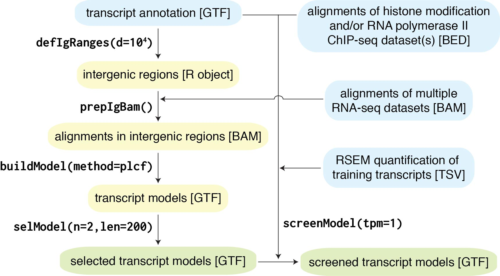

```{r setup, include = FALSE}
knitr::opts_chunk$set(
  collapse = TRUE,
  comment = "#>"
)
```


## Introduction

Pooling RNA-seq and Assembling Models (__PRAM__) utilizes multiple RNA-seq 
datasets to predict transcript models.  The workflow of PRAM contains five 
steps, which is shown in 
the figure below with function names and associated key parameters.  In later
sections of this vignette, we will describe each function in details.

```{r, fig.cap='PRAM workflow', out.width='579px', out.height='324px', echo=F}

```

## Installation

```
devtools::install_github('https://github.com/pliu55/pram')
```

## Quick start

### Predict transcript models only
```
pram(in_gtf, in_bamv, out_gtf)
```

#### Input
- `in_gtf`:  A GTF file defining existing gene ranges. Required to have
             `gene_id` in the attribute column (column 9).
- `in_bamv`:  A vector of BAM file(s) of RNA-seq alignments

#### Output
- `out_gtf`:  A GTF file of predicted transcript models


### Predict transcript models and screen them by ChIP-seq data
```
pram(in_gtf, in_bamv, out_gtf, in_bedv, training_gtf, training_tpms)
```

#### Input
- `in_gtf` and `in_bamv` are the same as [above](#predict-transcript-models-only)
- `in_bedv`:  A vector of BED file(s) of ChIP-seq alignments.
- `training_gtf`:  A GTF file defining training transcript's exons.
- `training_tpms`:  A 

#### Output
- `out_gtf` is the same as [above](#predict-transcript-models-only)

## Define intergenic genomic ranges: `defIgRanges()`

### Input and key parameters

### Example

## Prepare input RNA-seq alignments: `prepIgBam()`

## Build transcript models: `buildModel()`
PRAM's `buildModel()` function relies on two 
- Linux or Mac OS X

## Select transcript models: `selModel()`

## Screen transcript models: `screenModel()`

Vignettes are long form documentation commonly included in packages. Because they are part of the distribution of the package, they need to be as compact as possible. The `html_vignette` output type provides a custom style sheet (and tweaks some options) to ensure that the resulting html is as small as possible. The `html_vignette` format:

- Never uses retina figures
- Has a smaller default figure size
- Uses a custom CSS stylesheet instead of the default Twitter Bootstrap style

## Vignette Info

Note the various macros within the `vignette` section of the metadata block above. These are required in order to instruct R how to build the vignette. Note that you should change the `title` field and the `\VignetteIndexEntry` to match the title of your vignette.

## Styles

The `html_vignette` template includes a basic CSS theme. To override this theme you can specify your own CSS in the document metadata as follows:

    output: 
      rmarkdown::html_vignette:
        css: mystyles.css

## Figures

The figure sizes have been customised so that you can easily put two images side-by-side. 

```{r, fig.show='hold'}
plot(1:10)
plot(10:1)
```

You can enable figure captions by `fig_caption: yes` in YAML:

    output:
      rmarkdown::html_vignette:
        fig_caption: yes

Then you can use the chunk option `fig.cap = "Your figure caption."` in **knitr**.

## More Examples

You can write math expressions, e.g. $Y = X\beta + \epsilon$, footnotes^[A footnote here.], and tables, e.g. using `knitr::kable()`.

```{r, echo=FALSE, results='asis'}
knitr::kable(head(mtcars, 10))
```

Also a quote using `>`:

> "He who gives up [code] safety for [code] speed deserves neither."
([via](https://twitter.com/hadleywickham/status/504368538874703872))
