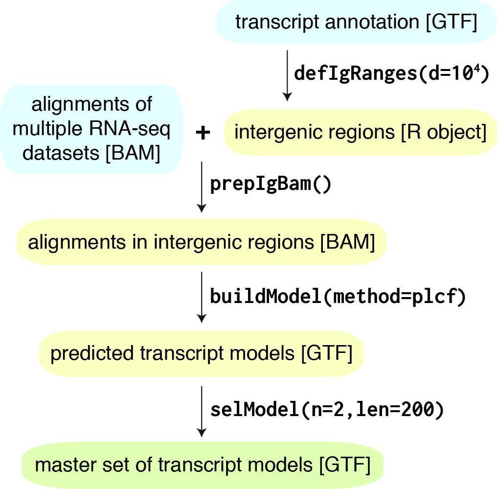

```{r setup, include = FALSE}
knitr::opts_chunk$set(
    collapse = TRUE,
    comment = "#>"
)
```


# Introduction

Pooling RNA-seq and Assembling Models (__PRAM__) is an __R__ package that 
utilizes multiple RNA-seq datasets to predict transcript models.  The workflow 
of PRAM contains four steps.  Figure 1 shows each step with function name and 
associated key parameters.  In addition, we provide a function named 
`evalModel()` to evaluate prediction accuracy by comparing transcript models 
with true transcripts.  In the later sections of this vignette, we will 
describe each function in details.  

```{r, fig.cap='PRAM workflow', out.width='237px', out.height='233px', echo=F}

```


# Installation

## From GitHub

Start __R__ and enter:

```{r installFromGitHub, eval=FALSE}
devtools::install_github('pliu55/pram')
```

## From Bioconductor
Start __R__ and enter:

```{r installFromBioconductor, eval=FALSE}
if (!requireNamespace("BiocManager", quietly = TRUE))
    install.packages("BiocManager")
BiocManager::install("pram")
```

For different versions of R, please refer to the appropriate 
[Bioconductor release](https://bioconductor.org/about/release-announcements/).


# Quick start

## Description
PRAM provides a function named `runPRAM()` to let you conveniently run through 
the whole workflow.

For a given gene annotation and RNA-seq alignments, you can predict transcript
models in intergenic genomic regions:

```{r runQuickPRAM, eval=FALSE}
##
## assuming the stringtie binary is in folder /usr/local/stringtie-1.3.3/
##
pram::runPRAM(  in_gtf, in_bamv, out_gtf, method='plst',
                stringtie='/usr/loca/stringtie-1.3.3/stringtie')
```

- `in_gtf`: an input GTF file defining genomic coordinates of existing genes. 
            Required to have an attribute of __gene_id__ in the ninth column.
- `in_bamv`: a vector of input BAM file(s) containing RNA-seq alignments.
            Currently,
            PRAM only supports strand-specific paired-end RNA-seq with the 
            first mate on the right-most of transcript coordinate, i.e., 
            'fr-firststrand' by Cufflinks definition.
- `out_gtf`: an output GTF file of predicted transcript models.
- `method`: prediction method.  For the command above, we were using pooling
            RNA-seq datasets and building models by __stringtie__. For a list 
            of available PRAM methods, please check Table \@ref(tab:methods)
            below.
- `stringtie`:  location of the __stringtie__ binary. PRAM's model-building step
                depends on external software. For more information on this 
                topic, please see Section \@ref(id:required-external-software) 
                below.


## Examples
PRAM has included input examples files in its `extdata/demo/` 
folder.  The table below provides a quick summary of all the example files.

Table: `runPRAM()`'s input example files.

| input argument | file name(s) |
|:--------------:|:------------:|
| `in_gtf`       | in.gtf       |
| `in_bamv`      | SZP.bam, TLC.bam   |

You can access example files by `system.file()` in __R__, e.g. for the 
argument `in_gtf`, you can access its example file by

```{r accessExample}
system.file('extdata/demo/in.gtf', package='pram')
```

Below shows the usage of `runPRAM()` with example input files: 

```{r runPRAM, eval=FALSE}
in_gtf = system.file('extdata/demo/in.gtf', package='pram')

in_bamv = c(system.file('extdata/demo/SZP.bam', package='pram'),
            system.file('extdata/demo/TLC.bam', package='pram') )

pred_out_gtf = tempfile(fileext='.gtf')

##
## assuming the stringtie binary is in folder /usr/local/stringtie-1.3.3/
##
pram::runPRAM(  in_gtf, in_bamv, pred_out_gtf, method='plst',
                stringtie='/usr/loca/stringtie-1.3.3/stringtie')
```


# Define intergenic genomic ranges: `defIgRanges()`

## Description
To predict intergenic transcripts, we must first define
intergenic regions by `defIgRanges()`.  This function requires a GTF file 
containing known gene annotation supplied for its `in_gtf` argument. This GTF 
file should contain an attribue of __gene_id__ 
in its ninth column.  We provided an example input GTF file in PRAM package: 
`extdata/gtf/defIGRanges_in.gtf`.

In addition to gene annotation, `defIgRanges()` also requires user to provide
chromosome sizes so that it would know the maximum genomic ranges.
You can provide one of the following arguments:

```{r echo=F}
url_hg19_chromsize=
'http://hgdownload.cse.ucsc.edu/goldenpath/hg19/database/chromInfo.txt.gz'
```

- `chromgrs`: a GRanges object, or
- `genome`: a genome name, currently supported ones are: 
    __hg19__, __hg38__, __mm9__, and __mm10__, or
- `fchromsize`: a UCSC genome browser-style size file, e.g.
[hg19](`r url_hg19_chromsize`)


By default, `defIgRanges()` will define intergenic ranges as regions 10 kb away
from any known genes.  You can change it by the `radius` argument.

## Example
```{r defIgRanges, warning=FALSE}
pram::defIgRanges(system.file('extdata/gtf/defIgRanges_in.gtf', package='pram'),
                genome = 'hg38')
```


# Prepare input RNA-seq alignments: `prepIgBam()`

## Description
Once intergenic regions were defined, `prepIgBam()` will extract corresponding
RNA-seq alignments from input BAM files.  In this way, transcript models 
predicted at later stage will solely from intergenic regions.  Also, with fewer
RNA-seq alignments, model prediction will run faster.

Three input arguments are required by `prepIgBam()`: 

- `finbam`: an input RNA-seq BAM file sorted by genomic coordinate. Currently, 
    we only support strand-specific
    paired-end RNA-seq data with the first mate on the right-most of transcript
    coordinate, i.e. 'fr-firststrand' by Cufflinks's definition.
- `iggrs`: a GRanges object to define intergenic regions.
- `foutbam`: an output BAM file.

## Example
```{r prepIgBam}
finbam =system.file('extdata/bam/CMPRep2.sortedByCoord.raw.bam', 
                    package='pram')

iggrs = GenomicRanges::GRanges('chr10:77236000-77247000:+')

foutbam = tempfile(fileext='.bam')

pram::prepIgBam(finbam, iggrs, foutbam)
```

# Build transcript models: `buildModel()`

## Description
`buildModel()` predict transcript models from RNA-seq BAM file(s).
This function requires two arguments:

- `in_bamv`: a vector of input BAM file(s)
- `out_gtf`: an output GTF file containing predicted transcript models


## Transcript prediction methods
`buildModel()` has implemented seven transcript prediction methods. You
can specify it by the `method` argument with one of the keywords:
__plcf__, __plst__, __cfmg__, __cftc__, __stmg__, __cf__, and __st__.
The first five denote meta-assembly methods that utilize multiple RNA-seq 
datasets to predict a single set of transcript models. The last two represent
methods that predict transcript models from a single RNA-seq dataset.

The table below compares prediction steps for these seven methods.  By 
default, `buildModel()` uses __plcf__ to predict transcript models.  

Table: (\#tab:methods)Prediction steps of the seven `buildModel()` methods

| method | meta-assembly | preparing RNA-seq input  | building transcripts | \
assembling transcripts |
|:--------:|:---:|:------------------:|:---------------:|:-----------------:|
| __plcf__ | yes | pooling alignments | Cufflinks       | no                |
| __plst__ | yes | pooling alignments | StringTie       | no                |
| __cfmg__ | yes | no                 | Cufflinks       | Cuffmerge         |
| __cftc__ | yes | no                 | Cufflinks       | TACO              |
| __stmg__ | yes | no                 | StringTie       | StringTie-merge   |
| __cf__   | no  | no                 | Cufflinks       | no                |
| __st__   | no  | no                 | StringTie       | no                |


## Required external software {#id:required-external-software} 
Depending on your specified prediction method, `buildModel()` requires 
external software: Cufflinks, StringTie and/or TACO, to build and/or assemble 
transcript 
models.  You can either specify the software location using the `cufflinks`, 
`stringtie`, and `taco` arguments in `buildModel()`, or simply leave these
three arugments undefined and let PRAM download them for you 
automatically. The table below summarized software versions `buildModel()` 
would download when required software was not specified.  Please note that, 
for __macOS__, pre-compiled Cufflinks binary 
versions 2.2.1 and 2.2.0 appear to have an issue on processing BAM files, 
therefore we recommend to use version 2.1.1 instead.


```{r echo=F}
url_cf_web = paste0('[Cufflinks, Cuffmerge]',
'(http://cole-trapnell-lab.github.io/cufflinks/)')

url_cf_lnx = paste0('[v2.2.1]',
'(http://cole-trapnell-lab.github.io/cufflinks/assets/',
'downloads/cufflinks-2.2.1.Linux_x86_64.tar.gz)')

url_cf_mac = paste0('[v2.1.1]',
'(http://cole-trapnell-lab.github.io/cufflinks/assets/',
'downloads/cufflinks-2.1.1.OSX_x86_64.tar.gz)')

cf_methods = '__plcf__, __cfmg__, __cftc__, and __cf__'

url_st_web = paste0('[StringTie, StringTie-merge]',
'(https://ccb.jhu.edu/software/stringtie/)')

url_st_lnx = paste0('[v1.3.3b]', 
'(http://ccb.jhu.edu/software/stringtie/dl/',
'stringtie-1.3.3b.Linux_x86_64.tar.gz)')

url_st_mac = paste0('[v1.3.3b]', 
'(http://ccb.jhu.edu/software/stringtie/dl/',
'stringtie-1.3.3b.OSX_x86_64.tar.gz)')

st_methods = '__plst__, __stmg__, and __st__'

url_tc_web = '[TACO](https://tacorna.github.io)'

url_tc_lnx = paste0('[v0.7.0]', 
'(https://github.com/tacorna/taco/releases/download/',
'v0.7.0/taco-v0.7.0.Linux_x86_64.tar.gz)')

url_tc_mac = paste0('[v0.7.0]',
'(https://github.com/tacorna/taco/releases/download/',
'v0.7.0/taco-v0.7.0.OSX_x86_64.tar.gz)')
```

Table: (\#tab:software)`buildModel()`-required software and recommended version

| software | Linux binary | macOS binary | required by |
|:--------:|:------------:|:------------:|:-----------:|
| `r url_cf_web` | `r url_cf_lnx` | `r url_cf_mac` | `r cf_methods` |
| `r url_st_web` | `r url_st_lnx` | `r url_st_mac` | `r st_methods` |
| `r url_tc_web` | `r url_tc_lnx` | `r url_tc_mac` | __cftc__       |


## Example
```{r buildModel, eval=FALSE}
fbams = c(  system.file('extdata/bam/CMPRep1.sortedByCoord.clean.bam', 
                        package='pram'),
            system.file('extdata/bam/CMPRep2.sortedByCoord.clean.bam', 
                        package='pram') )

foutgtf = tempfile(fileext='.gtf')

##
## assuming the stringtie binary is in folder /usr/local/stringtie-1.3.3/
##
pram::buildModel(fbams, foutgtf, method='plst',
                stringtie='/usr/loca/stringtie-1.3.3/stringtie')
```


# Select transcript models: `selModel()`

## Description
Once transcript models were built, you may want to select a subset of them by
their genomic features. `selModel()` was developed for this purpose. 
It allows you to select transcript models by their total number of exons and 
total length of exons and introns.

`selModel()` requires two arguments:

- `fin_gtf`:input GTF file containing to-be-selected transcript models. This
            file is required to have __transcript_id__ attribute in the ninth
            column.
- `fout_gtf`: output GTF file containing selected transcript models.


By default: `selModel()` will select transcript models with $\ge$ 2 exons and 
$\ge$ 200 bp total length of exons and introns.  You can change the default 
using the `min_n_exon` and `min_tr_len` arguments.

## Example
```{r selModel}
fin_gtf = system.file('extdata/gtf/selModel_in.gtf', package='pram')

fout_gtf = tempfile(fileext='.gtf')

pram::selModel(fin_gtf, fout_gtf)
```


# Evaluate transcript models: `evalModel()`

## Motivation
After PRAM has predicted a number of transcript models, you may wonder how 
accurate these models are. To answer this question, you can compare PRAM 
models with real transcripts (i.e., positive controls) that you know should be 
predicted. PRAM's `evalModel()` function will help you to make such comparison.
It will calculate precision and recall rates on three features of a transcript: 
exon nucleotides, individual splice junctions, and transcript structure (i.e.,
whether all splice junctions within a transcript were constructed in a model).

## Input
`evalModel()` requires two arguments:

- `model_exons`: genomic coordinates of transcript model exons.
- `target_exons`: genomic coordinates of real transcript exons. 

The two arguments can be in multiple formats:

- both are `GRanges` objects
- both are `character` objects denoting names of GTF files 
- both are `data.table` objects containing the following five columns for each
    exon:
    - __chrom__: chromosome name
    - __start__: starting coordinate
    - __end__: ending coordinate
    - __strand__: strand information, either '+' or '-'
    - __trid__: transcript ID
- `model_exons` is the name of a GTF file and `target_exons` is a `data.table`
    object.

## Output
The output of `evalModel()` is a `data.table` object, where columns are 
evaluation results and each row is three transcript features. 

Table: `evalModel()` output columns

| column name   | representation                       |
|:-------------:|:------------------------------------:|
| __feat__      | transcript feature                   |
| __ntp__       | number of true positives (TP)        |
| __nfn__       | number of false negatives (FN)       |
| __nfp__       | number of false positives (FP)       |
| __precision__ | precision rate: $\frac{TP}{(TP+FP)}$ |
| __recall__    | recall rate: $\frac{TP}{(TP+FN)}$    |


Table: `evalModel()` output rows

| feature name | representation             |
|:------------:|:--------------------------:|
| __exon_nuc__ | exon nucleotide            |
| __indi_jnc__ | individual splice junction |
| __tr_jnc__   | transcript structure       |


## Example
```{r evalModel}
fmdl = system.file('extdata/benchmark/plcf.tsv', package='pram')
ftgt = system.file('extdata/benchmark/tgt.tsv',  package='pram')

mdldt = data.table::fread(fmdl, header=TRUE, sep="\t")
tgtdt = data.table::fread(ftgt, header=TRUE, sep="\t")

pram::evalModel(mdldt, tgtdt)
```


# Session Info
Below is the output of `sessionInfo()` on the system on which this document 
was compiled.

``` {r sessionInfo, echo=FALSE}
sessionInfo()
```
